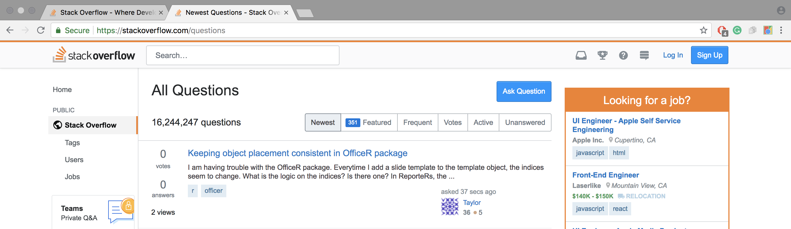

# CloseAllTabsFromSite
===========

This simple Google Chrome extension allows the user to close all tabs from a website with a single click of a button.

## How It Works
The user navigates to an open tab of the website they would like to close all tabs from. 

Then, the user clicks on the extension and a popup appears.

The user then clicks on the button "close all tabs from site" to close all open tabs with the same host name. 
